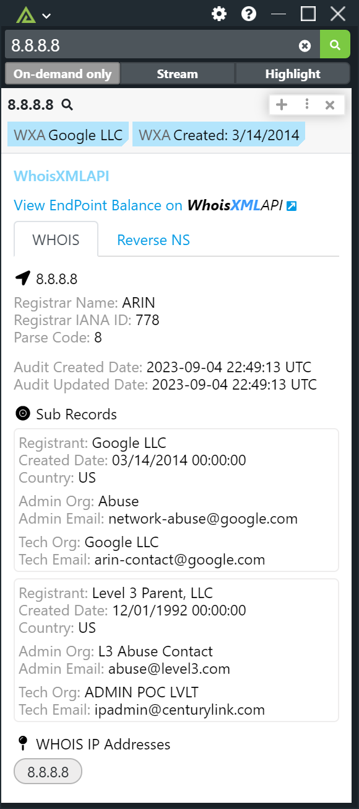
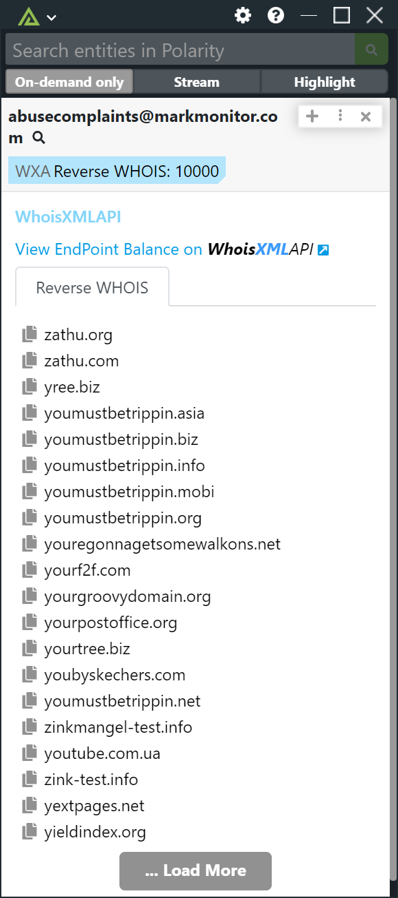

# Polarity WhoisXMLAPI Integration

WhoisXMLAPI has unique collection of cyber threat intelligence feeds have proven invaluable in augmenting the capabilities of commercial security platforms (SIEM, SOAR and TIP) and helping Security Operations Centers (SOCs) & Managed Security Service Providers (MSSPs) achieve superior network visibility.

The WhoisXMLAPI Polarity Integration allows you to search WHOIS, Reverse WHOIS, DNS, WHOIS DNS History, Domain Purchase Availability, & Reverse NS, via Domains and by Annotations.

|  |  |  
|----------------------------------------|---------------------------------------------|-------------------------------------------|
| *IP WHOIS Example*                     | *Domain WHOIS Example*                | *Email Reverse WHOIS Example*             |

To learn more about WhoisXMLAPI, visit the [official website](https://main.whoisxmlapi.com/).

## WhoisXMLAPI Integration Options

### API Key

A valid WhoisXMLAPI API key

### Enable Reverse WHOIS Lookups

If checked, the integration will perform Reverse WHOIS lookups on emails, annotated entities, and "all text" if those Data Types are enabled. Configure which Data Types are enabled for Reverse WHOIS searches via the Data Types page.

## Installation Instructions

Installation instructions for integrations are provided on the [PolarityIO GitHub Page](https://polarityio.github.io/).

## Polarity

Polarity is a memory-augmentation platform that improves and accelerates analyst decision making. For more information about the Polarity platform please see:

https://polarity.io/
