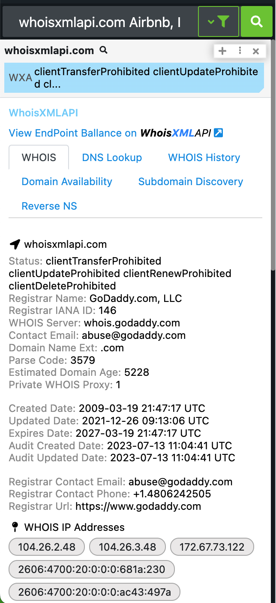
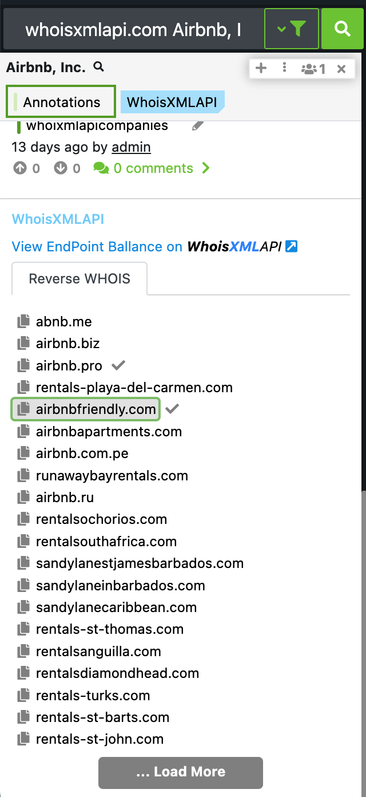

# Polarity WhoisXMLAPI Integration

WhoisXMLAPI has unique collection of cyber threat intelligence feeds have proven invaluable in augmenting the capabilities of commercial security platforms (SIEM, SOAR and TIP) and helping Security Operations Centers (SOCs) & Managed Security Service Providers (MSSPs) achieve superior network visibility.

The WhoisXMLAPI Polarity Integration allows you to search WHOIS, Reverse WHOIS, DNS, WHOIS DNS History, Domain Purchase Availability, & Reverse NS, via Domains and by Annotations.

  
  

To learn more about WhoisXMLAPI, visit the [official website](https://main.whoisxmlapi.com/).

## WhoisXMLAPI Integration Options

### API Key
A Company API Key associated with your WhoisXMLAPI Instance

## Installation Instructions

Installation instructions for integrations are provided on the [PolarityIO GitHub Page](https://polarityio.github.io/).

## Polarity

Polarity is a memory-augmentation platform that improves and accelerates analyst decision making. For more information about the Polarity platform please see:

https://polarity.io/
